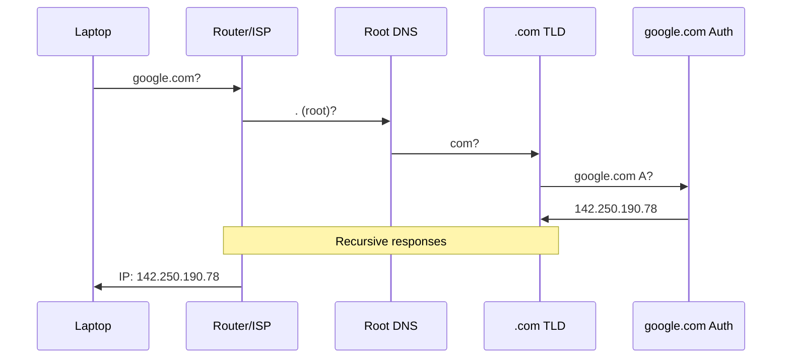
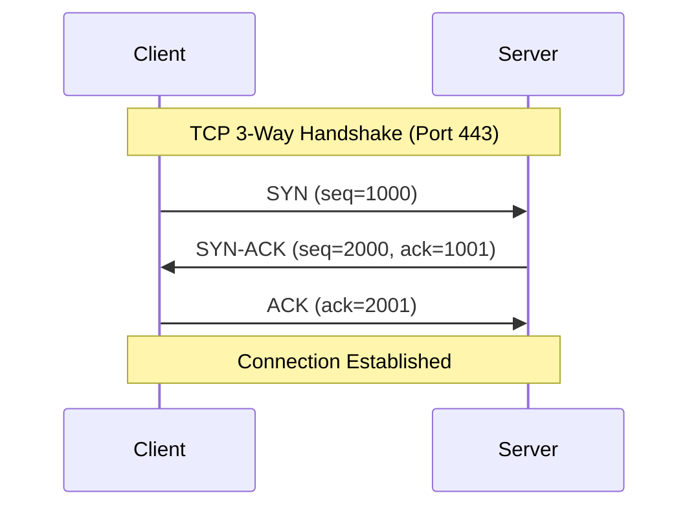
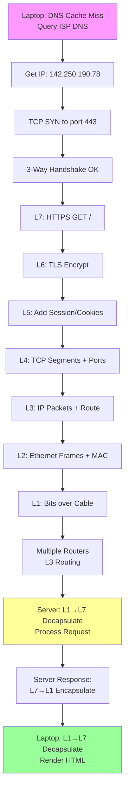

# OSI Model - Detailed Explanation with Example: Accessing https://www.google.com

## Overview

The OSI (Open Systems Interconnection) model is a conceptual framework used to understand network interactions. It divides communication into **7 layers**, each with specific functions. Data moves **down the stack** (encapsulation) when sending from laptop to server, and **up the stack** (decapsulation) when receiving the response.

**Example Scenario**: Your laptop sends an HTTPS request to `https://www.google.com` (which resolves to an IP like 142.250.190.78). Path: Laptop → Home Router → ISP Routers → Google Servers → reverse path.

## Step 1: DNS Resolution (Before Layers)

Before any layers, resolve domain to IP:

1. **Local Cache**: Browser/OS checks local DNS cache (e.g., `ipconfig /displaydns` on Windows).
2. **Home Router Cache**: No hit? Query router's cache.
3. **ISP DNS**: Query ISP's recursive resolver. ISP checks its cache or forwards:
   - Root DNS servers (13 worldwide) → TLD (.com) → Authoritative (google.com NS records) → A record IP.
4. **TTL Cache**: Store result (e.g., 300s) to avoid repeats.

**Diagram**:

Now IP known: Proceed to TCP + Layers.

## Step 2: TCP 3-Way Handshake (Transport Layer Prep - L4)

Establishes reliable connection **before** L7 request. Uses resolved IP + port 443 (HTTPS).

**Detailed Flow**:

1. **SYN**: Client → Server: "Can I connect?" (seq=1000)
2. **SYN-ACK**: Server → Client: "Yes, my seq=2000" (ack=1001)
3. **ACK**: Client → Server: "Got it" (ack=2001)

Connection ready!

**Enhanced Diagram**:

## Step 3: Sending Request (Laptop → Server: Encapsulation L7 → L1)

| Layer  | Name         | Function          | Details for HTTPS Request                                                                                          | Protocol/Header Added                |
| ------ | ------------ | ----------------- | ------------------------------------------------------------------------------------------------------------------ | ------------------------------------ |
| **L7** | Application  | Generates request | Browser crafts HTTPS GET `/` to google.com (User-Agent, Host header).                                              | HTTP/1.1 + TLS (HTTPS)               |
| **L6** | Presentation | Format/Encrypt    | Encrypts with TLS/SSL (AES), compresses (gzip), syntax (JSON/XML).                                                 | TLS Header (handshake done in L7/L6) |
| **L5** | Session      | Manage connection | Session ID in cookies (e.g., SID=abc123). Persistent for google.com (no re-auth), limited for banking.             | Session markers (cookies, tokens)    |
| **L4** | Transport    | Reliable delivery | Splits into **segments**, adds src/dst ports (e.g., ephemeral:54321 → 443), seq/ack/checksum. TCP for reliability. | TCP Header (ports, seq)              |
| **L3** | Network      | Routing           | Adds **source IP** (your public IP) + **dst IP** (142.250.190.78). Becomes **packets**. Routers decide path (BGP). | IP Header                            |
| **L2** | Data Link    | Local delivery    | Adds MAC addresses (src: NIC → dst: router), **frames** for switch. Ethernet common.                               | Ethernet Frame (MAC, CRC)            |
| **L1** | Physical     | Transmission      | **Bits** as electrical/optical signals over cable/WiFi. NIC → cable → router port.                                 | Bits/Signals (1s/0s)                 |

**Sending Path**: Browser (L7) → OS/Network stack → Home Router (L3 route) → ISP → Internet backbone → Google edge router.

## Step 4: Receiving Response (Server → Laptop: Decapsulation L1 → L7)

Reverse process at server (decapsulate to data) → sends response → your path reverse.

- Server: L1 bits → L2 frames → L3 packets → L4 segments → L5 session → L6 decrypt → L7 HTTP 200 OK + HTML.
- TCP ensures order/retransmits lost segments.

**Full Flow Diagram**:

## Key Notes

- **HTTPS**: TLS spans L6/L7 (handshake post-TCP).
- **Real-world**: TCP/IP 4 layers map to OSI (App=4-7, Transport=4, Internet=3, Link=1-2).
- **Errors**: TCP retransmits; ICMP for "host unreachable".
- **Performance**: Caching (DNS, sessions) avoids repeats.

## OSI Layers Summary Table (Original + Enhanced)

| Layer # | Name         | Key Protocols                | PDU      | Devices           |
| ------- | ------------ | ---------------------------- | -------- | ----------------- |
| 7       | Application  | HTTP/HTTPS, FTP, DNS (query) | Data     | Browsers, Apps    |
| 6       | Presentation | TLS/SSL, JPEG                | Data     | Gateways          |
| 5       | Session      | NetBIOS, RPC                 | Data     | Gateways          |
| 4       | Transport    | TCP (reliable), UDP          | Segments | N/A               |
| 3       | Network      | IP, ICMP, OSPF               | Packets  | Routers           |
| 2       | Data Link    | Ethernet, PPP                | Frames   | Switches, Bridges |
| 1       | Physical     | Cables, WiFi                 | Bits     | Hubs, Cables      |

